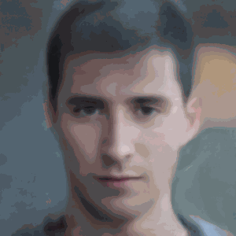
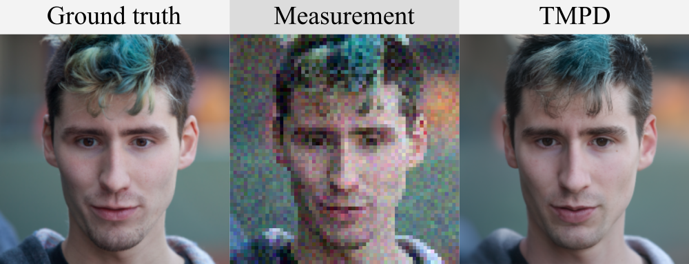

[Tweedie Moment Projected Diffusions for Inverse Problems](https://arxiv.org/pdf/2310.06721.pdf)
========================================================



This repo contains the official implementation for the paper [Tweedie Moment Projected Diffusions for Inverse Problems](https://arxiv.org/pdf/2310.06721.pdf). An example of an application to a particular inverse problem, noisy super-resolution on FFHQ is below. The animation is of the expected value of a particular sample of an image over the time steps of our algorithm.




Thank you to [nPlan](https://www.nplan.io/), who are supporting this project.

Contents:
- [Installation](#installation)
- [Experiments](#experiments)
    - [Gaussian](#gaussian)
    - [Gaussian Mixture Model](#gmm)
    - [Noisy inpainting, super resolution and deblur](#noisy-inpainting,-super-resolution-and-deblur)
- [Does haves](#does-haves)
- [Doesn't haves](#doesn't-haves)

## Installation
The package requires Python 3.7. First, it is recommended to [create a new python virtual environment](https://conda.io/projects/conda/en/latest/user-guide/tasks/manage-environments.html#creating-an-environment-with-commands). This package depends on an old version of tensorflow to be compatible with the pretrained diffusion models. First, [install `tensorflow=2.7.0`](https://www.tensorflow.org/install/pip).

```
pip install --upgrade pip
conda install -c conda-forge cudatoolkit=11.8.0
python3 -m pip install nvidia-cudnn-cu11==8.6.0.163 tensorflow==2.7.0
```

Then, install `jax==0.2.18`. This package depends on an old version JAX to be compatible with the pretrained diffusion models. Note the JAX installation is different depending on your CUDA version, so you may have to install JAX differently than below.
```sh
pip install jax==0.2.18 jaxlib==0.1.69+cuda111 -f https://storage.googleapis.com/jax-releases/jax_cuda_releases.html
```

Make sure the tensorflow and jax versions are as above and are working on your accelerator. Then,
- Install `diffusionjax` (you may need to remove the dependency of orbax and optax, which conflicts with Python 3.7).
- Clone the repository `git clone git@github.com:bb515/tmpd.git`.
- Install using pip `pip install -e .` from the working directory of this README file (see the `setup.py` for the requirements that this command installs).

## Experiments

### Gaussian
Reproduce our experiment by typing 
```sh
python grf.py:
  --config: Training configuration.
    (default: './configs/grf.py')
  --workdir: Working directory
    (default: './workdir')
```

### GMM
Reproduce our experiment by typing 
```sh
python gmm.py:
  --config: Training configuration.
    (default: './configs/gmm.py')
  --workdir: Working directory
    (default: './workdir')
```

### Noisy inpainting, super resolution and deblur

First, download the checkpoints and place them into an `exp/` folder in the working directory of this README file.

You will require the pre-trained model checkpoints to access the score models. All checkpoints are from [Score-Based Generative Modeling through Stochastic Differential Equations](https://github.com/yang-song/score_sde/blob/main/README.md) and provided in this [Google drive](https://drive.google.com/drive/folders/1RAG8qpOTURkrqXKwdAR1d6cU9rwoQYnH).

Please note that if for any reason you need to download the CelebAHQ and/or FFHQ datasets, you will need to manually download them using these [instructions](https://github.com/tkarras/progressive_growing_of_gans#preparing-datasets-for-training). 

Reproduce our inpainting, super_resolution and deblur experiments through `main.py`. Please first 
download the FID statistics for CIFAR-10 using these [instructions](https://github.com/yang-song/score_sde/tree/main#:~:text=Stats%20files%20for%20quantitative%20evaluation) and place them into the `assets/` folder in the working directory of this README file.
```sh
python main.py:
  --config: Configuration.
  --eval_folder: The folder name for storing evaluation results.
    (default: 'eval')
  --mode: <eval_inpainting|eval_super_resolution|eval_deblur>: Run evaluation on: inpainting, super_resolution or deblur.
  --workdir: Working directory.
```

* `config` is the path to the config file. They are adapted from [these configurations](https://github.com/yang-song/score_sde/tree/main/configs). Our prescribed config files are provided in `configs/`.

*  `workdir` is the path that stores all artifacts of an experiment, like checkpoints, which are required for loading the score model.

* `eval_folder` is the name of a subfolder in `workdir` that stores all artifacts of the evaluation process, like image samples, and numpy dumps of quantitative results.

* `mode` is the inverse problem. When set to {"eval_inpainting", "eval_super_resolution", "eval_deblur"}, it performs our {inpainting, super resolution, deblur} experiment.

The experimental setup can be configured through the config file and the experimental parameters within `run_lib.py`.

We also provide scripts to simply sample from either inpainting, super_resolution and deblur experiments through `main.py`.
```sh
python main.py:
  --config: Configuration.
  --eval_folder: The folder name for storing evaluation results.
    (default: 'eval')
  --mode: <inpainting|super_resolution|deblur>: Run sampling on: inpainting, super_resolution or deblur.
  --workdir: Working directory.
```

## Does haves
- Bayesian inversion (inverse problems) with linear observation maps such as: super-resolution, inpainting, deblur, and easily extendable to non-linear observation operators.
- Implementations of TMPD as well as other baselines, such as [ΠGDM](https://openreview.net/forum?id=9_gsMA8MRKQ) and [DPS](https://arxiv.org/abs/2209.14687).
- DDIM, DDPM, SMLD samplers/Markov chains.
- Get started with the fully reproducible numerical experiments from our paper, provided.

## Doesn't haves
- Medical imaging inverse problem examples.
- Text-guided image editing.

